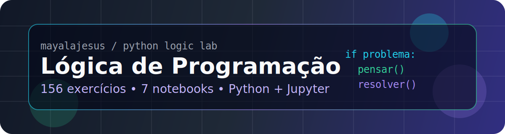

<p align="center">
  
</p>

<p align="center">
  
  
  
  
</p>

<h1 align="center">logica-python-lab</h1>

<p align="center">
  Repositório pessoal de prática em lógica de programação com Python.
</p>

---

## 🧭 Visão geral

Este projeto funciona como um caderno público de exercícios. A proposta é registrar minha evolução resolvendo problemas de lógica, desde os fundamentos da linguagem até desafios integrados envolvendo algoritmos, funções, coleções, arquivos e validação de dados.

## 🎯 Objetivo

Praticar programação de forma consistente, com foco em:

| Área | O que é treinado |
| --- | --- |
| 🧩 Interpretação | leitura de enunciados e decomposição de problemas |
| 🐍 Python básico | entrada, saída, variáveis, tipos e operadores |
| 🔀 Controle de fluxo | condicionais, laços, validações e sentinelas |
| 🧱 Estruturas | strings, listas, tuplas, conjuntos, dicionários e matrizes |
| 🧰 Organização | funções, parâmetros, retorno, escopo e modularização |
| ⚙️ Algoritmos | busca, ordenação, recursão e raciocínio algorítmico |
| 📄 Dados | arquivos, tratamento de erros, CSV e JSON |
| 🧪 Projetos | mini-sistemas, jogos, simulações e desafios integrados |

## 📚 Notebooks

| # | Notebook | Tema | Atividades |
| ---: | --- | --- | ---: |
| 01 | [`01_fundamentos_python.ipynb`](01_fundamentos_python.ipynb) | fundamentos de Python | 24 |
| 02 | [`02_decisoes_e_repeticao.ipynb`](02_decisoes_e_repeticao.ipynb) | condicionais e laços | 24 |
| 03 | [`03_colecoes_e_texto.ipynb`](03_colecoes_e_texto.ipynb) | strings, listas, dicionários e matrizes | 24 |
| 04 | [`04_funcoes_e_modularizacao.ipynb`](04_funcoes_e_modularizacao.ipynb) | funções e organização do código | 24 |
| 05 | [`05_algoritmos_classicos.ipynb`](05_algoritmos_classicos.ipynb) | busca, ordenação, recursão e problemas clássicos | 24 |
| 06 | [`06_arquivos_erros_e_dados.ipynb`](06_arquivos_erros_e_dados.ipynb) | arquivos, erros, CSV e JSON | 18 |
| 07 | [`07_desafios_integrados.ipynb`](07_desafios_integrados.ipynb) | mini-sistemas, jogos e simulações | 18 |

**Total:** 156 atividades.

## 🗂️ Arquivos de apoio

- [`docs/plano-de-estudo.md`](docs/plano-de-estudo.md): sequência sugerida de estudo.
- [`docs/progresso.md`](docs/progresso.md): controle de avanço por notebook.
- [`.github/workflows/notebook-check.yml`](.github/workflows/notebook-check.yml): validação automática dos notebooks.

## 🧪 Fluxo de estudo

```text
escolher_notebook
    → resolver_atividade
    → testar_solucao
    → revisar_codigo
    → registrar_progresso
```

## ✅ Critérios

- Resolver antes de consultar soluções externas.
- Evitar atalhos de biblioteca quando o objetivo for treinar implementação manual.
- Refatorar depois que a primeira solução funcionar.
- Manter os notebooks organizados para leitura no GitHub.
- Registrar o progresso em [`docs/progresso.md`](docs/progresso.md).

<details>
<summary><strong>🧠 Ordem sugerida da trilha</strong></summary>

1. Fundamentos de Python
2. Decisões e repetição
3. Coleções e texto
4. Funções e modularização
5. Algoritmos clássicos
6. Arquivos, erros e dados
7. Desafios integrados

</details>
